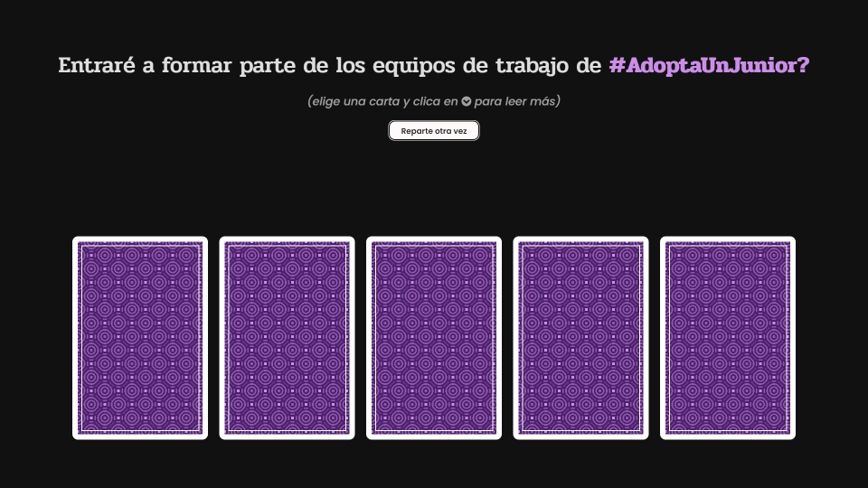
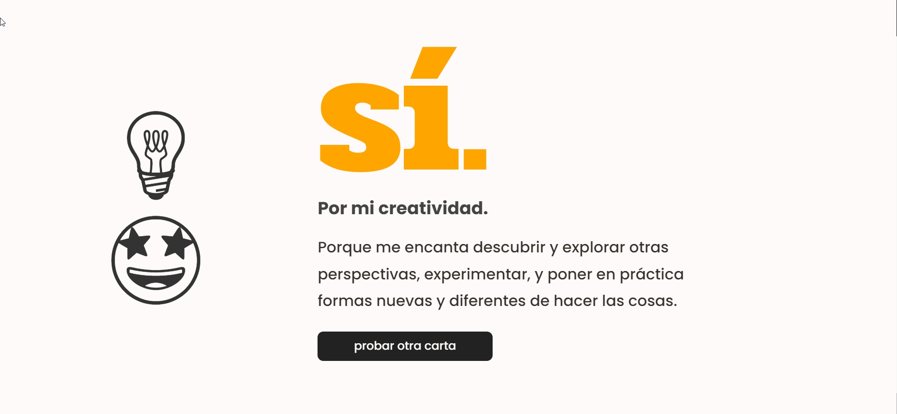
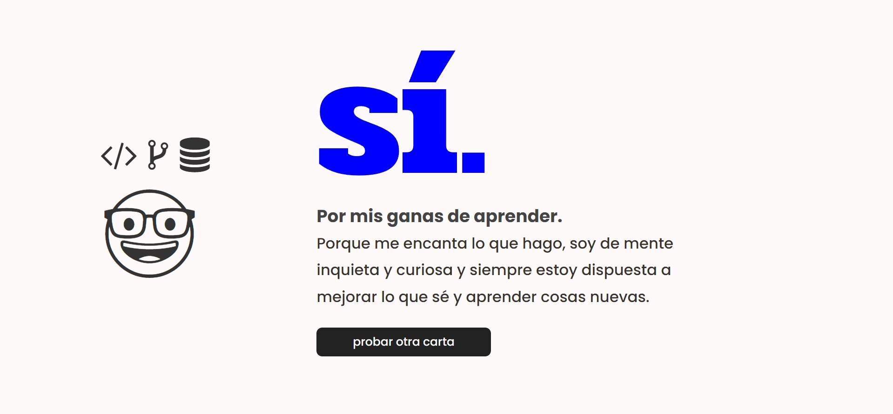
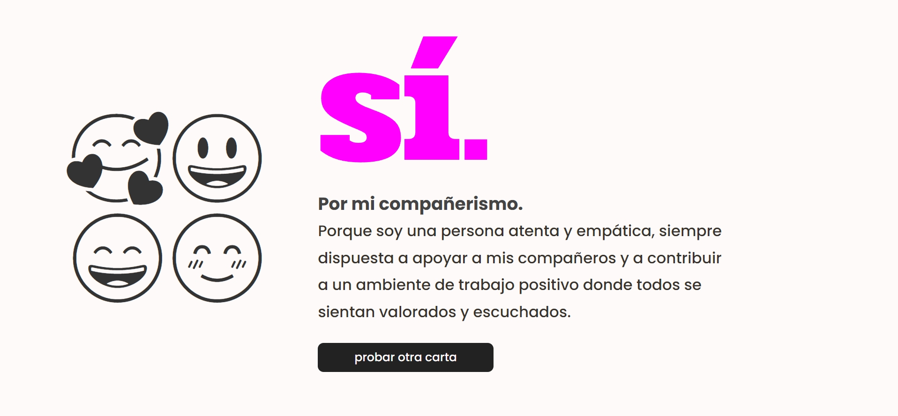
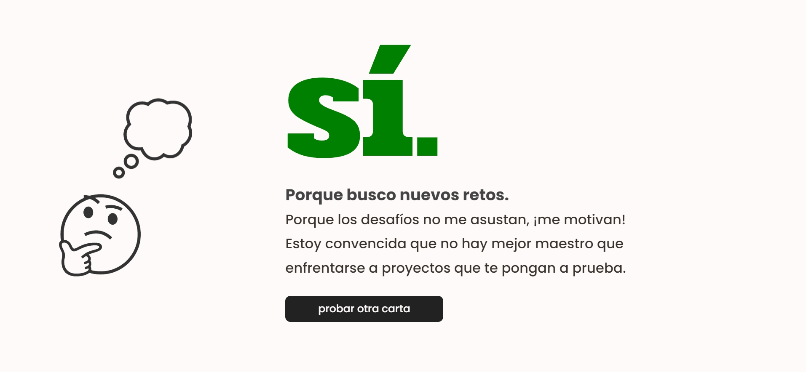
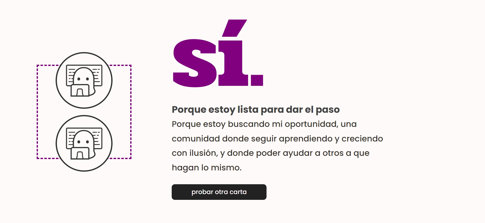

# 👩🏻‍💻 #AdoptaUnJunior Grupos de Trabajo - II Convocatoria

> **Disciplina:** Frontend  
> **Aspirante:** Marta Vilaseca Foradada

- [Acerca del proyecto](#acerca-del-proyecto)
- [Sobre mí](#mi-perfil)
- [Grupos de trabajo AUJ](#grupos-de-trabajo-auj)
- [Briefing y checklist](#briefing-y-checklist)

---

## Acerca del proyecto

https://marta-vilaseca.github.io/adoptaunjunior/

En mi tiempo libre me gusta mucho jugar a juegos, tanto videojuegos como de mesa o basados en cartas, así que decidí transformar el sencillo briefing presentándolo como un juego muy simple: se te presentan unas cartas boca abajo, que puedes volver a mezclar y repartir cuando quieras, y al descubrir una de esas cartas obtienes una imagen asociada a un concepto, a través del cual se responde a una pregunta inicial: **Entraré a formar parte de los equipos de trabajo de #AdoptaUnJunior?**

Viene a ser un minijuego de adivinación en realidad, clicas sobre la carta para leer la interpretación de la respuesta que te ha salido... el _plot twist_ es que la respuesta siempre es **sí** :smile:

|  |  |  |  |  |
| ----------------------------------------------- | -------------------------------------------- | ------------------------------------------------- | ----------------------------------- | ------------------------------------------- |

### Colaboraciones

- [Creé una issue](https://github.com/marta-vilaseca/adoptaunjunior/issues/1) solicitando ayuda para **mejorar el visualizado de la aplicación en pantallas pequeñas**.
  - **[Sergio](https://github.com/scsanchez)** pudo resolver una parte ([su PR](https://github.com/marta-vilaseca/adoptaunjunior/pull/2)), pero la visualización de los distintos apartados con los emojis quedó pendiente; por cuestiones de timing (poder llegar a tiempo a la _deadline_ semanal) terminé de resolver y refactorizar yo la parte que faltaba ([mi commit](https://github.com/marta-vilaseca/adoptaunjunior/commit/7c5c34b0be2a6e9cef9674c9c675174cc5bdc171))

### Tecnologías, Recursos y Herramientas utilizadas

    

- [Noto Emoji](https://fonts.google.com/noto/specimen/Noto+Emoji) y [Fork Awesome](https://forkaweso.me/Fork-Awesome/) para los emojis e iconos
- **Unsplash** para las imágenes de las cartas ([1](https://unsplash.com/photos/a-bunch-of-flowers-gugHSr1eUek), [2](https://unsplash.com/photos/person-using-macbook-air-on-brown-wooden-table-ZsWaYLImZFs), [3](https://unsplash.com/photos/smiley-paint-on-gray-ground-in-front-of-people-zi5vRoAP3WY), [4](https://unsplash.com/photos/black-flat-screen-computer-monitor-cFFEeHN), [5](https://unsplash.com/photos/tilt-shift-photography-of-shoes-b9vkGONY4eI))
- Fondo de la parte de atrás de las cartas hecho gracias a los [CSS Pattern Backgrounds](https://superdesigner.co/tools/css-backgrounds) de **Superdesigner**

### Posibles mejoras futuras

- [ ] Introducir tests sencillos con Jest para comprobar funcionamiento y renderizado
- [ ] Mejoras a nivel visual:
  - [ ] Mejoras de diseño generales
  - [ ] Sustituir Fork Awesome por otra librería de iconos (_\* dado que recientemente han añadido un aviso conforme está deprecada_)
  - [ ] Animación más compleja para las cartas
  - [ ] Diferenciar un modo claro/oscuro (con style switcher?)
- [ ] Añadir un apartado de about: un poco de CV/resume sencillo, skills/stack, enlaces a RRSS...

---

## Grupos de Trabajo AUJ

Mi primer contacto con el diseño y el desarrollo web fue de forma autodidacta, y **trabajé en ello tanto por cuenta ajena como propia durante varios años**. Por circunstancias de la vida tuve que apartarme del sector, pero siempre, siempre me quedó el gusanillo de querer volver.

_Fast-forward_ hasta el día de hoy, cuando después varios meses preparándome y reciclándome con la ayuda de distintos cursos y recursos (el último y más grande, el **Bootcamp Full Stack de KeepCoding** que estoy a punto de terminar) empiezo a sentirme preparada para VOLVER en mayúsculas. **Ahora lo que me falta es la oportunidad!** Tener la ocasión de formar parte de una comunidad y trabajar en un entorno lo más real posible, con tal de coger confianza y experiencia, perder el miedo y sacudirme ese síndrome del impostor que tanto nos frena a todos los que estamos abriéndonos camino (en mi caso por segunda vez).

No se me ocurre forma mejor de conseguir todo eso que estos grupos de trabajo, donde coincidiría con gente en mi misma situación, con las mismas ganas de aprender y empoderarse y ayudar a los demás a conseguir lo mismo. Además creo que estoy en el momento ideal para hacerlo, porque me coincide con el final del bootcamp y es un momento en el que estoy muy motivada, pero a la vez con bastante miedo de enfrentarme a la realidad del mercado actual. **Creo sinceramente que es la oportunidad perfecta para demostrar (a mí misma y a todo el mundo!) de qué soy capaz y lo mucho que puedo aportar** 💪🏻🤓

---

## Mi perfil

**Cinco adjetivos que me describen:** empática, creativa, curiosa, analítica y perseverante.
**Mis puntos fuertes:** HTML, CSS y diseño de UI. Las ganas de aprender y mejorar constantemente. Adaptabilidad, paciencia, escucha activa. Soy una persona autosuficiente y metódica, me esfuerzo en escribir código ordenado y prestar atención al detalle. Me gusta mucho documentar todo lo que hago.

### Mi stack

**Frontend**: HTML & CSS (SASS, Tailwind, BootStrap), JavaScript, TypeScript, React, Redux  
**Backend**: Node.js, MongoDB  

**Metas de aprendizaje (prioritarias):** TDD, UX, Accesibilidad, seguir mejorando en todo lo anterior  
**Metas de aprendizaje (secundarias):** Next.js, Python, Astro...  

  

---

## Briefing

### Semana 1

- [x] Crea un repositorio en GitHub donde muestres con código sencillo por qué deseas formar parte de los grupos de trabajo de Frontend
- [x] Comparte tu usuario de GitHub y el acceso al repositorio con nosotros para poder seguir tus avances
- [x] EXTRA - repo desplegado y funcionando aquí: https://marta-vilaseca.github.io/adoptaunjunior/

### Semana 2

- [x] Colaboración: Solicita una colaboración dentro de tu repositorio.
- [x] Issue: Crea una issue que alguien más deba resolver en otra rama.
- [x] Documentación: Documenta cómo debe realizarse la issue y, una vez resuelta, acepta la pull request (PR)

### Semana 3

- [x] Readme: Después de aceptar la PR, crea un archivo README.
- [x] Documentación: Documenta lo que has creado, las contribuciones que te han realizado
  - [x] explica por qué deberías ser seleccionado para los grupos de trabajo de Frontend
